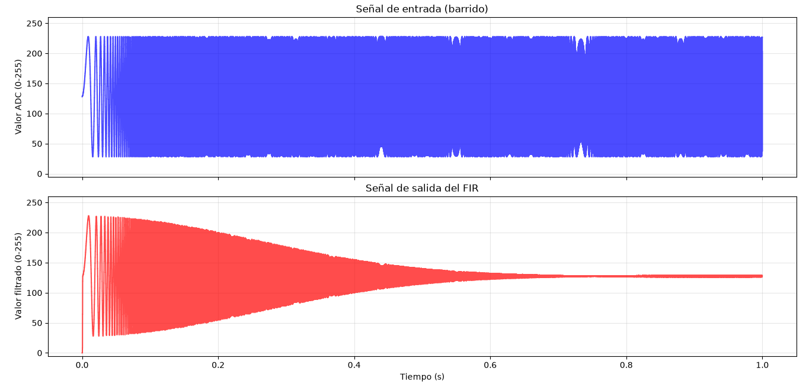
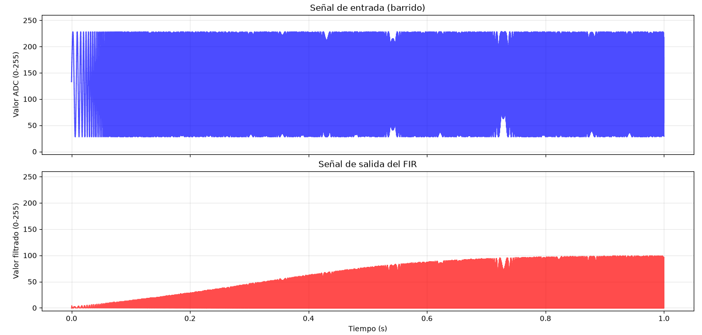
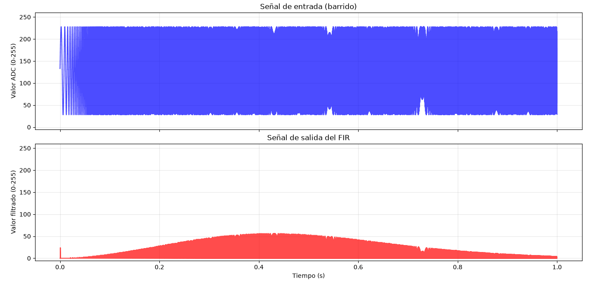

# FIR FILTER for RISC-V Microcontroller with Hardware Accelerators

Proyecto de diseño y desarrollo de un microcontrolador basado en **RISC-V**, tomando como referencia la arquitectura de **PicoRV32**.

El objetivo es integrar diferentes módulos de procesamiento y periféricos directamente en hardware, incluyendo:

- Filtro digital FIR
- Acelerador PID
- Módulo PWM
- Comunicación UART
- Comunicación SPI

## Estado del proyecto

**En desarrollo**

Actualmente el proyecto se encuentra en la etapa de **diseño y pruebas del filtro FIR**. La integración del resto de los módulos se realizará posteriormente.

## Filtro FIR

El filtro FIR está siendo desarrollado en **SystemVerilog** y se está probando inicialmente de forma independiente antes de integrarlo al microcontrolador RISC-V.

Actualmente se están trabajando:

- Filtros pasa bajos (LPF)
- Filtros pasa altos (HPF)
- Filtros pasa banda (BPF)
- Diseño de coeficientes mediante el método de ventanas
- Ventana de Hamming
- Aritmética de punto fijo **Q2.14**
- Multiplicación y acumulación de muestras y coeficientes
- Pruebas con diferentes frecuencias de corte
- Simulación y verificación de la respuesta del filtro

## Generación de señales y pruebas

Se desarollo una herramienta en **Python** con ayuda de IA para generar automáticamente las señales utilizadas durante las pruebas del FIR.

La herramienta permite:

- Generar barridos de frecuencia (chirp)
- Generar señales compuestas por diferentes frecuencias
- Agregar ruido
- Aplicar offset para representar señales provenientes de un ADC
- Cuantizar las señales a 8 bits
- Generar archivos de entrada para la simulación
- Leer los datos de salida del FIR
- Graficar y comparar las señales de entrada y salida

El flujo de prueba actual es:

```text
Python
   │
   ▼
Generación de señal
   │
   ▼
Cuantización a 8 bits
   │
   ▼
entrada.txt
   │
   ▼
Simulación SystemVerilog
   │
   ▼
Filtro FIR
   │
   ▼
salida.txt
   │
   ▼
Python
   │
   ▼
Análisis y gráficas


 Herramienta FIR – Generador de señales y coeficientes para SystemVerilog

Herramienta en Python para diseñar filtros FIR de **8 coeficientes** (modificable), generar señales de prueba y visualizar la respuesta de tu implementación en SystemVerilog.

Ideal para verificar filtros **pasa bajos (LPF)**, **pasa altos (HPF)** y **pasa banda (BPF)** en un entorno de simulación con Icarus Verilog.

---

##  Características principales

- **Cálculo de coeficientes FIR**:
  - LPF, HPF y BPF mediante el método de la ventana (Hamming, Hanning, Blackman o rectangular).
  - Los coeficientes se muestran en formato **Q2.14** (enteros con signo de 16 bits), listos para copiar y pegar en tu testbench.
  - Cada filtro puede tener su propia frecuencia de corte (independiente entre LPF, HPF y BPF).

- **Generación de señales de prueba**:
  - **Barrido en frecuencia** (chirp lineal) desde 100 Hz hasta 6 kHz (ajustable).
  - **Suma de armónicos** (senoides) con amplitudes configurables.
  - Offset ajustable (por defecto 128) para simular un ADC de 8 bits sin signo.
  - Ruido blanco opcional con amplitud configurable.
  - Cuantificación a 8 bits (0–255) y guardado en formato binario (`entrada.txt`).

- **Visualización**:
  - Gráfica de la señal de entrada y de la señal filtrada (leída desde `salida.txt`).
  - Ejes de tiempo compartidos para comparar fácilmente el efecto del filtro.

- **Flexibilidad**:
  - Todos los parámetros se modifican al inicio del script (sin necesidad de tocar el código interno).
  - Fácil de adaptar a diferentes frecuencias de muestreo, duraciones, amplitudes y tipos de prueba.

---

##  Requisitos

- Python 3.6 o superior.
- Bibliotecas:
  - `numpy`
  - `matplotlib`

Instálalas con:

```bash
pip install numpy matplotlib


## Datos optenidos en simulacion
- pasa bajos


-pasa altos


-pasa banda



## Pasos para correr la simulacion

1.- correr el programa de python : cd/python
					python fir_testbench_generator.py  "activar entorno virtual antes de la simulacion: source mi_proyecto/bin/activate"
					
2.- copiar los coheficientes que arroja la terminal despues de correr el programa en python, los coheficientes se deben pegar al tb.sv en el apartado de coeficientes

3.- correr la simulacion en icarus
desde el directorio del filtro_fir:
        			bash:	iverilog -g2012 -o sim/simulacion rtl/filtro_fir.sv tb/tb.sv 
despues correr la simulacion 

				bash: vvp sim/simulacion
				
4.- volver a correr el programa en python como en el paso 1
//////////////


					
## Filtro FIR: desarrollado por Francisco A Perez	
